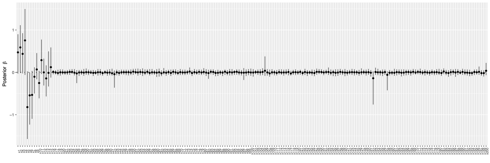

# BayesSurv


This is a R/Rcpp package **BayesSurv** for a Bayesian Cox model with graph-structured selection priors for sparse identification of omics features predictive of survival ([Madjar et al., 2021](https://doi.org/10.1186/s12859‐021‐04483‐z)) and its extension with the use of a fixed graph via a Markov Random Field (MRF) prior for capturing known structure of omics features, e.g. disease-specific pathways from the Kyoto Encyclopedia of Genes and Genomes (KEGG) database.

## Installation

Install the latest development version from GitHub

```r
#options(timeout = max(300, getOption("timeout")))
#install.packages("remotes")
remotes::install_github("tobiasoh/master_thesis/BayesSurv")
```

## Examples

### Simulate data

```r

library(MASS)
library(survival)
library(mvtnorm)

set.seed(123)
p = 200
trueBeta = runif(20, min=-1, max=1)
trueBeta = c(1,1,1,1,-1,-1,-1)
trueBeta = c(trueBeta, rep(0, p - length(trueBeta)))

sigma = diag(p)
block = matrix(rep(.5,9), nrow=3); diag(block) = 1
sigma[1:3, 1:3] = block#sigma[4:6, 4:6] = sigma[7:9, 7:9] = block

sigma = diag(p)
block = matrix(rep(.5,15*15), nrow=15); diag(block) = 1
sigma[1:15, 1:15] = block

truePara = list("beta" = trueBeta, "sigma" = sigma)
mcmc_iterations = 1000
graph="true"
seed = sample(1:10e7, 1)
set.seed(seed)

truePara$gamma = as.numeric(truePara$beta != 0)

# simulate underlying graph of the covariance matrix
G = matrix(data = as.numeric( truePara$sigma != 0 ), nrow=p, ncol=p)
diag(G) = 0 
sigma = truePara$sigma

if (grepl("true", graph, fixed=T)) {
  G = matrix(data = as.numeric( sigma != 0 ), nrow=p, ncol=p)
  diag(G) = 0  
}

if (grepl("empty", graph, fixed=T))
  G = matrix(0, nrow=p, ncol=p)  

priorParaPooled = list(
  #"eta0"   = eta0,                   # prior of baseline hazard
  #"kappa0" = kappa0,                 # prior of baseline hazard
  "c0"     = 2,                      # prior of baseline hazard
  "tau"    = 0.0375,                 # standard deviation for prior of regression coefficients
  "cb"     = 20,                     # standard deviation for prior of regression coefficients
  "pi.ga"  = 0.02, #0.5, ga.pi,                   # prior variable selection probability for standard Cox models
  "a"      = -4, #a0,                     # hyperparameter in MRF prior
  "b"      = 0.1, #b0,                     # hyperparameter in MRF prior
  "G"       = G
) 

Beta.ini = rep(0, p)
beta.ini  = Beta.ini 
gamma.ini = rep(0,p)

initial = list("gamma.ini" = gamma.ini, "beta.ini" = beta.ini, "log.like.ini" = 0)

n = 100
p = length(truePara$beta)

#simulated gene expression data, for two subgroups, split into test and training data
sim.surv = function(X, beta, surv.e, surv.c, n){
  library(survival)
  
  # simulate event times from Weibull distribution
  dt = (-log(runif(n)) * (1/surv.e$scale) * exp(-X %*% beta))^(1/surv.e$shape)
  
  # simulate censoring times from Weibull distribution
  cens = rweibull(n, shape = surv.c$shape, scale = ((surv.c$scale)^(-1/surv.c$shape)))
  
  # observed time and status for each observation
  status = ifelse(dt <= cens, 1, 0)
  time = pmin(dt, cens)
  
  return(list(as.numeric(status), as.numeric(time)))
}
sim_data_fun <- function(n, p, surv.e, surv.c, beta1.p, beta2.p, cov_matrix){
  
  library(survival)
  library(mvtnorm) 
  library(MASS)
  
  p.e = length(beta1.p) # Number of prognostic variables 
  
  # True effects in each subgroup
  beta1 = c( beta1.p, rep(0,p-p.e) )
  beta2 = c( beta2.p, rep(0,p-p.e) )
  
  # Covariance matrix in both subgroups
  #sigma = diag(p)
  #block = matrix(rep(.5,9), nrow=3); diag(block) = 1
  #sigma[1:3, 1:3] = sigma[4:6, 4:6] = sigma[7:9, 7:9] = block
  
  sigma = cov_matrix
  
  # Sample gene expression data from multivariate normal distribution
  X.train1 = mvrnorm(n, rep(0,p), sigma)  
  X.train2 = mvrnorm(n, rep(0,p), sigma)
  X.test1 = mvrnorm(n, rep(0,p), sigma)  
  X.test2 = mvrnorm(n, rep(0,p), sigma)
  
  # Simulate survival data for both subgroups
  surv1 = sim.surv(X.train1, beta1, surv.e[[1]], surv.c[[1]], n) 
  surv2 = sim.surv(X.train2, beta2, surv.e[[2]], surv.c[[2]], n) 
  surv1t = sim.surv(X.test1, beta1, surv.e[[1]], surv.c[[1]], n) 
  surv2t = sim.surv(X.test2, beta2, surv.e[[2]], surv.c[[2]], n) 
  
  # Combine training and test data of both subgroups
  data1 = list("X.train" = X.train1, "time.train" = surv1[[2]], "status.train" = surv1[[1]])
  data2 = list("X.train" = X.train2, "time.train" = surv2[[2]], "status.train" = surv2[[1]])
  Data = list(data1, data2)
  
  data1 = list("X.test" = X.test1, "time.test" = surv1t[[2]], "status.test" = surv1t[[1]])
  data2 = list("X.test" = X.test2, "time.test" = surv2t[[2]], "status.test" = surv2t[[1]])
  Data.test = list(data1, data2)
  
  # Scale covariates using parameters of training data
  sd.train = lapply(Data, function(X) apply(X$X.train,2,sd))  
  for(g in 1:length(Data)){
    Data.test[[g]]$X.test <- scale(Data.test[[g]]$X.test, scale=sd.train[[g]])
    Data[[g]]$X.train <- scale(Data[[g]]$X.train, scale=sd.train[[g]])
  }
  
  # Unscaled covariates (for Pooled model):
  Data[[1]]$X.train.unsc = X.train1
  Data[[2]]$X.train.unsc = X.train2
  Data.test[[1]]$X.test.unsc = X.test1
  Data.test[[2]]$X.test.unsc = X.test2
  
  return(list("Traindata" = Data, "Testdata" = Data.test))
}

#load data from the main directory of the repository
load("Weibull_param.RData")
sim_data = sim_data_fun(n=n, p=p, surv.e=Surv.e, surv.c=Surv.c, beta1.p = truePara$beta, beta2.p = truePara$beta, cov_matrix=truePara$sigma)
```


### Run a Bayesian Cox model

```r
## prepare data
dataset = list("X" = sim_data$Traindata[[1]]$X.train, 
               "t" = sim_data$Traindata[[1]]$time.train,
               "di" = sim_data$Traindata[[1]]$status.train)

log.like  = coxph( Surv(dataset$t, dataset$di, type = c('right')) ~ 1 )$loglik # initial value: null model without covariates
initial$log.like.ini = log.like

## run a model
library(BayesSurv)
fit = BayesSurv(survObj=dataset, priorPara=priorParaPooled, 
                initial=initial, nIter=100, seed=123)

library(ggplot2)
plot(fit) + 
  coord_flip() + 
  theme(axis.text.x = element_text(angle = 90, size = 7))

#plot(fit$output$beta.p[,1], type="l")
#colMeans(fit$output$beta.p[-c(1:(nrow(fit$output$beta.p)/2)), ])
#colMeans(fit$output$gamma.p[-c(1:(nrow(fit$output$gamma.p)/2)), ])
#trueBeta
```




## References

> Katrin Madjar, Manuela Zucknick, Katja Ickstadt, Jörg Rahnenführer (2021).
> Combining heterogeneous subgroups with graph‐structured variable selection priors for Cox regression.
> _BMC Bioinformatics_, 22(1):586. DOI:[10.1186/s12859‐021‐04483‐z](https://doi.org/10.1186/s12859‐021‐04483‐z).
